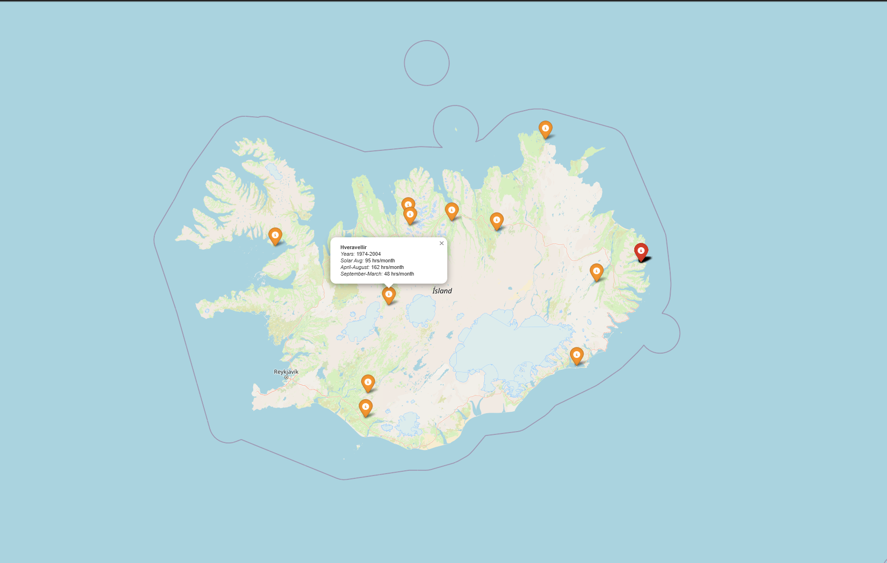

# Solar-Incidents-Iceland
Python code that I wrote to take CSV files of meteorological data (specifically 'sun') and turn them into usable information, as well as a cool little map.
Here is the link to the working [HTML](https://tyler-jones8209.github.io/Solar-Incidents-Iceland/iceland_solar_map.html).

## HTML Page

